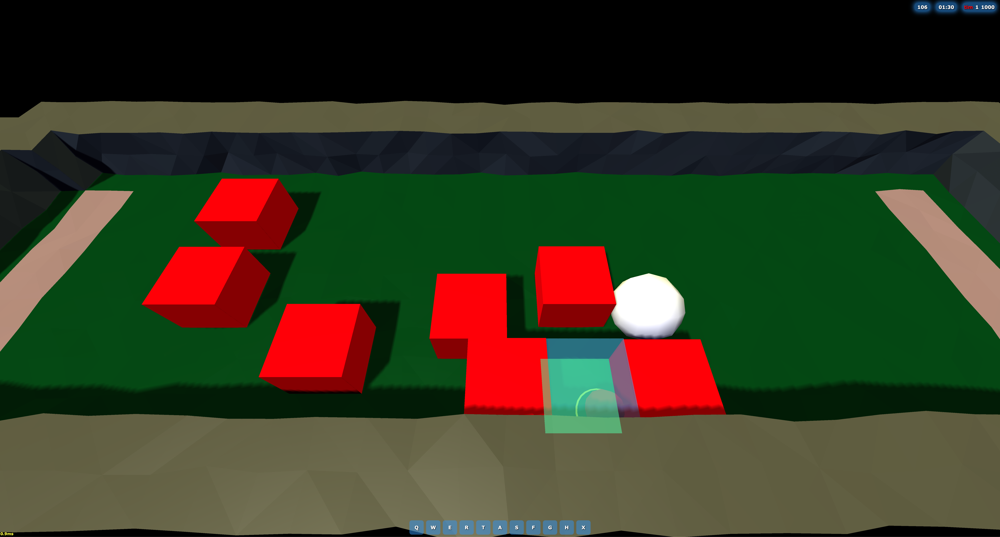

# webcraft

This is a recreation of a WarCraft III game called Bulldog Excursion, which
itself is a mix-up on
[Sheep Tag](https://www.youtube.com/results?search_query=sheep+tag). The
original goal was to get the base game working, which has been completed. Now
the goal is to generalize the code towards an ECS game engine that can support
any WC3 map.

## mvp-bd-server

[mvp-bd-server](https://github.com/voces/mvp-bd-server) acts as the server/host.
It's a Node.js app which handles connection logic, message passing, and
otherwise just runs the same simulation as the connecting clients (this repo).

## Contributing

Completely open to contributors; feel free to submit a PR addressing an existing issue or anything else!
